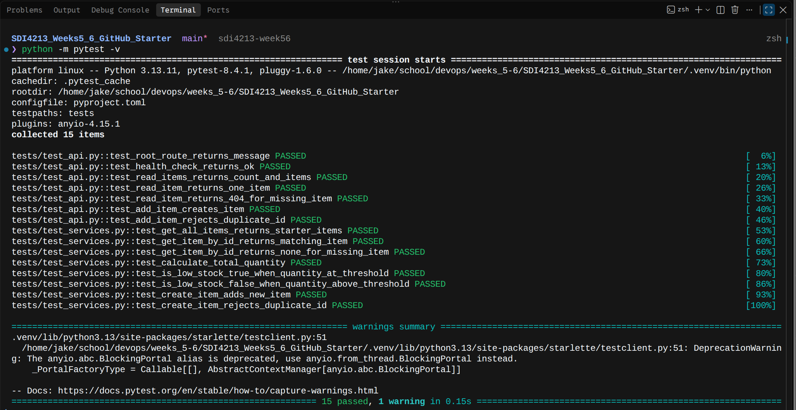
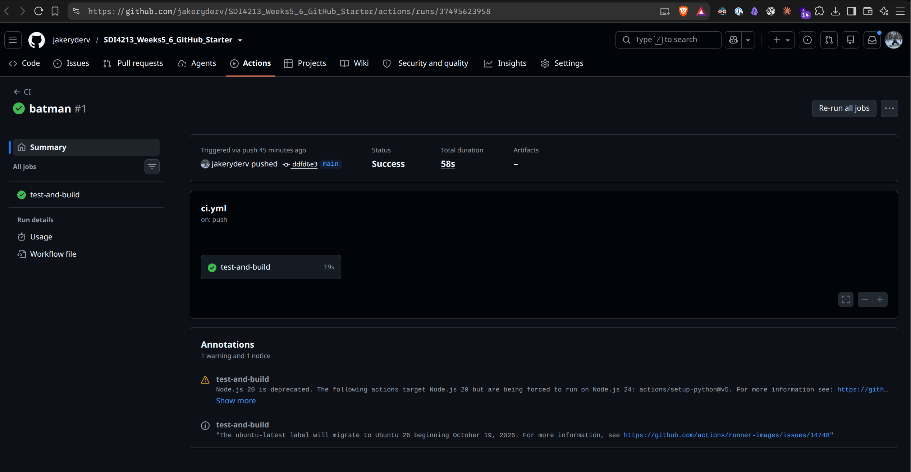
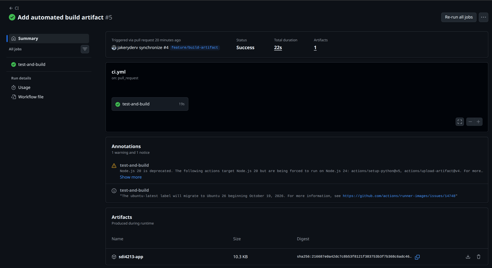
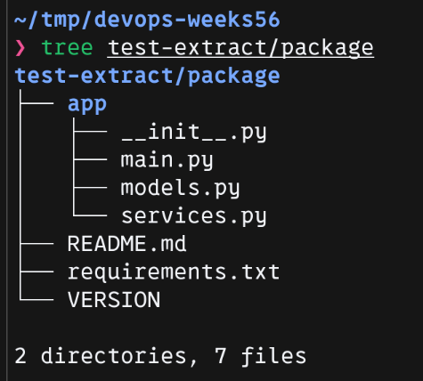

# Week 5-6 Exercise Evidence

Name:
GitHub repository URL: https://github.com/jakeryderv/SDI4213_Weeks5_6_GitHub_Starter

## Part A - Starting validation
- Local pytest result: 15 passed, 1 deprecation warning, using Python 3.13.11 and pytest 8.4.1 in the saved screenshot.
- Local test command: `python -m pytest -v`.
- Initial CI workflow run URL: https://github.com/jakeryderv/SDI4213_Weeks5_6_GitHub_Starter/actions/runs/37495623958
- Initial CI commit: `ddfd6e30531e6638e2f2912def40f2a27ce5f521` on `main`.



Milestone 1 - All 15 starter tests pass locally with the uv setup.

The local screenshot already uses `pyproject.toml`; it records local success after setup changes rather than an untouched-project baseline.



Milestone 2 - Baseline GitHub Actions CI workflow passes.

Workflow run: https://github.com/jakeryderv/SDI4213_Weeks5_6_GitHub_Starter/actions/runs/37495623958

### Setup validation

- Setup issue: https://github.com/jakeryderv/SDI4213_Weeks5_6_GitHub_Starter/issues/1
- Requirements export: `make requirements` completed successfully on 2026-10-06.
- Local checks: `make check` completed successfully on 2026-10-06: Ruff lint passed, all 16 Python files were already formatted, and all 15 tests passed with 1 dependency deprecation warning.
- Warning: Starlette's test client references the deprecated `anyio.abc.BlockingPortal` alias. The warning did not fail the tests.

## Part B - Week 5 build automation

- Build issue: https://github.com/jakeryderv/SDI4213_Weeks5_6_GitHub_Starter/issues/3
- Pull request URL: https://github.com/jakeryderv/SDI4213_Weeks5_6_GitHub_Starter/pull/4
- Successful workflow run URL: https://github.com/jakeryderv/SDI4213_Weeks5_6_GitHub_Starter/actions/runs/37510119164
- Build commit: `c416ea0636616ae3a54ff3b4819202450e241727` on `feature/build-artifact`.
- Artifact name: `sdi4213-app`.
- Packaged ZIP: `sdi4213-app.zip` inside the downloaded GitHub Actions artifact archive.
- Downloaded package contents: `app/`, `requirements.txt`, `README.md`, and `VERSION`. The application directory contains `__init__.py`, `main.py`, `models.py`, and `services.py`.
- Verification: GitHub Actions CI passed on 2026-10-06 and uploaded one artifact. The downloaded artifact was extracted locally, and its application ZIP contained all four required entries without Python cache files.



Milestone 3 - The GitHub Actions run succeeds and lists the uploaded `sdi4213-app` artifact.

### Downloaded artifact extraction

After downloading the artifact into `~/tmp/devops-weeks56`, extract the GitHub Actions archive, then the application ZIP it contains:

```bash
cd ~/tmp/devops-weeks56
unzip sdi4213-app.zip -d test-extract
unzip test-extract/sdi4213-app.zip -d test-extract/package
tree test-extract/package
```



Milestone 4 - The terminal listing of the extracted package shows `app/`, `requirements.txt`, `README.md`, and `VERSION`, with 2 directories and 7 files.

## Part C - Version and release
- Version:
- Git tag:
- GitHub Release URL:
- Short release-note summary:

## Part D - Week 6 Docker
- Docker image name and tag:
- `docker images` evidence:
- `docker ps` evidence:
- `/health` response:
- `docker logs` evidence:

## Reflection
1. What is the difference between a workflow artifact and a Docker image?
2. Why did you tag the Git release and Docker image with a version?
3. What does `-p 8000:8000` do?
4. What would you automate next if this project were moving toward deployment?
