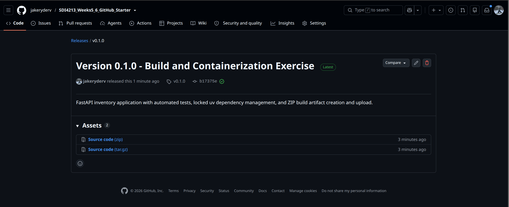
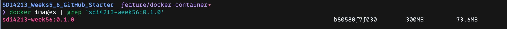
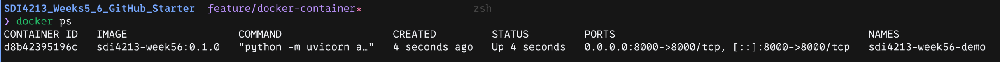
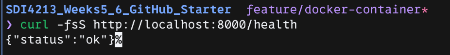
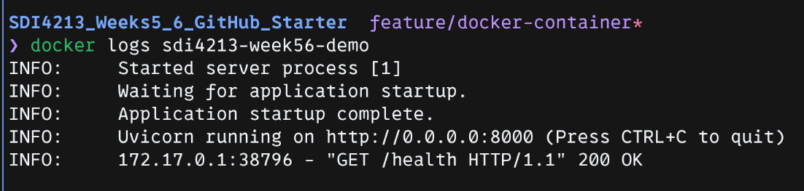

# Week 5-6 Exercise Evidence

Name:
GitHub repository URL: https://github.com/jakeryderv/SDI4213_Weeks5_6_GitHub_Starter

## Part A - Starting validation
- Local pytest result: 15 passed, 1 deprecation warning, using Python 3.13.11 and pytest 8.4.1 in the saved screenshot.
- Local test command: `python -m pytest -v`.
- Initial CI workflow run URL: https://github.com/jakeryderv/SDI4213_Weeks5_6_GitHub_Starter/actions/runs/37495623958
- Initial CI commit: `ddfd6e30531e6638e2f2912def40f2a27ce5f521` on `main`.


Milestone 1 - All 15 starter tests pass locally with the uv setup.

The local screenshot already uses `pyproject.toml`; it records local success after setup changes rather than an untouched-project baseline.


Milestone 2 - Baseline GitHub Actions CI workflow passes.

Workflow run: https://github.com/jakeryderv/SDI4213_Weeks5_6_GitHub_Starter/actions/runs/37495623958

### Setup validation

- Setup issue: https://github.com/jakeryderv/SDI4213_Weeks5_6_GitHub_Starter/issues/1
- Requirements export: `make requirements` completed successfully on 2026-10-06.
- Local checks: `make check` completed successfully on 2026-10-06: Ruff lint passed, all 16 Python files were already formatted, and all 15 tests passed with 1 dependency deprecation warning.
- Warning: Starlette's test client references the deprecated `anyio.abc.BlockingPortal` alias. The warning did not fail the tests.

## Part B - Week 5 build automation

- Build issue: https://github.com/jakeryderv/SDI4213_Weeks5_6_GitHub_Starter/issues/3
- Pull request URL: https://github.com/jakeryderv/SDI4213_Weeks5_6_GitHub_Starter/pull/4
- Successful workflow run URL: https://github.com/jakeryderv/SDI4213_Weeks5_6_GitHub_Starter/actions/runs/37510119164
- Build commit: `c416ea0636616ae3a54ff3b4819202450e241727` on `feature/build-artifact`.
- Artifact name: `sdi4213-app`.
- Packaged ZIP: `sdi4213-app.zip` inside the downloaded GitHub Actions artifact archive.
- Downloaded package contents: `app/`, `requirements.txt`, `README.md`, and `VERSION`. The application directory contains `__init__.py`, `main.py`, `models.py`, and `services.py`.
- Verification: GitHub Actions CI passed on 2026-10-06 and uploaded one artifact. The downloaded artifact was extracted locally, and its application ZIP contained all four required entries without Python cache files.


Milestone 3 - The GitHub Actions run succeeds and lists the uploaded `sdi4213-app` artifact.

### Downloaded artifact extraction

After downloading the artifact into `~/tmp/devops-weeks56`, extract the GitHub Actions archive, then the application ZIP it contains:

```bash
cd ~/tmp/devops-weeks56
unzip sdi4213-app.zip -d test-extract
unzip test-extract/sdi4213-app.zip -d test-extract/package
tree test-extract/package
```


Milestone 4 - The terminal listing of the extracted package shows `app/`, `requirements.txt`, `README.md`, and `VERSION`, with 2 directories and 7 files.

## Part C - Version and release

- Version: `0.1.0`.
- Git tag: `v0.1.0`.
- GitHub Release URL: https://github.com/jakeryderv/SDI4213_Weeks5_6_GitHub_Starter/releases/tag/v0.1.0
- Release title: `Version 0.1.0 - Build and Containerization Exercise`.
- Short release-note summary: FastAPI inventory application with automated tests, locked uv dependency management, and ZIP build artifact creation and upload.



Milestone 5 - Versioned GitHub Release v0.1.0 published.

## Part D - Week 6 Docker

- Containerization issue: https://github.com/jakeryderv/SDI4213_Weeks5_6_GitHub_Starter/issues/5
- Working branch: `feature/docker-container`.

### Docker setup verification

- `docker --version`: Docker version 29.8.2, build `7fc2dff`.
- `docker compose version`: Docker Compose version `v5.6.0`.
- `docker run --rm hello-world`: completed successfully on 2026-10-06 with the `Hello from Docker!` message; the verification container was automatically removed.

### Application container evidence

- Docker image name and tag: `sdi4213-week56:0.1.0`.
- Image ID: `b80580f7f030`.
- Container name: `sdi4213-week56-demo`.
- `docker images` evidence: Screenshot 6 shows the versioned image using `docker images | grep 'sdi4213-week56:0.1.0'`.
- `docker ps` evidence: Screenshot 7 shows container `d8b42395196c` running from `sdi4213-week56:0.1.0`, with host port 8000 mapped to container port 8000 for IPv4 and IPv6.
- `/health` response: `curl -fsS http://localhost:8000/health` returned `{"status":"ok"}` in Screenshot 8.
- `docker logs` evidence: Screenshot 9 shows application startup completing, Uvicorn listening on `0.0.0.0:8000`, and `GET /health HTTP/1.1` returning `200 OK`.

Build and run commands:

```bash
docker build -t sdi4213-week56:0.1.0 .
docker run -d -p 8000:8000 \
  --name sdi4213-week56-demo \
  sdi4213-week56:0.1.0
```



Milestone 6 - Versioned Docker image built successfully.

Command: `docker images | grep 'sdi4213-week56:0.1.0'`.



Milestone 7 - Container is running and port 8000 is published.

Command: `docker ps`.



Milestone 8 - Containerized application health check succeeds.

Command: `curl -fsS http://localhost:8000/health`. Response: `{"status":"ok"}`.



Milestone 9 - Container logs confirm the application started and handled requests.

Command: `docker logs sdi4213-week56-demo`.

### Container cleanup

The demo container was stopped and removed after verification:

```bash
docker stop sdi4213-week56-demo
docker rm sdi4213-week56-demo
docker images
```

A subsequent read-only check confirmed that `sdi4213-week56:0.1.0` still exists and no container named `sdi4213-week56-demo` remains. Removing the container did not remove its image.

### Final pull request and CI

- Pull request URL: pending.
- Successful workflow run URL: pending.
- Milestone 10 screenshot: pending the containerization pull request and successful CI checks.

## Reflection

1. What is the difference between a workflow artifact and a Docker image?

   A workflow artifact preserves files produced by a CI run. In this exercise, the artifact is a ZIP containing the application source, exported requirements, README, and version file. It still needs a Python environment and dependency installation to run. The Docker image packages the application with the Python runtime, installed dependencies, and startup command so a container can run it. See [GitHub's workflow artifact documentation](https://docs.github.com/en/actions/concepts/workflows-and-actions/workflow-artifacts) and [Docker's image explanation](https://docs.docker.com/get-started/docker-concepts/the-basics/what-is-an-image/).

2. Why did you tag the Git release and Docker image with a version?

   The Git tag `v0.1.0` identifies the source revision published as the release, while the Docker tag `0.1.0` labels the application's image version. Using the same application version connects the release and image and helps distinguish versions during testing, deployment, and troubleshooting.

3. What does `-p 8000:8000` do?

   It maps TCP port 8000 on the host to port 8000 inside the container. The first number is the host port and the second is the container port, allowing `http://localhost:8000/health` to reach Uvicorn inside the container. The captured `docker ps` output shows the mapping on IPv4 and IPv6 host addresses. See [Docker's port publishing documentation](https://docs.docker.com/engine/network/port-publishing/).

4. What would you automate next if this project were moving toward deployment?

   I would extend CI to build the Docker image after tests pass, run it temporarily, verify the health endpoint, and remove the test container. After an approved release, the workflow could publish the versioned image to a container registry and deploy it to a staging environment with another health check.
